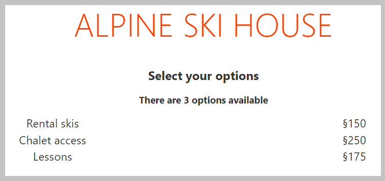

Let's start by displaying the list of all available options. For purposes of this exercise, we are simulating the data already being loaded, and is stored in a variable named `options`. You will start by cloning the project, exploring the existing code, and then making the necessary updates to generate the display.

## Clone the starter repository

This module has an associated starter repository. This starter allows you to focus on only the concepts in this module.

You'll need [Git](https://git-scm.com/?azure-portal=true), [Node.js](https://nodejs.org/?azure-portal=true) and [Visual Studio Code](https://code.visualstudio.com/?azure-portal=true) installed.

1. Clone the starter repository and open the folder in Visual Studio Code by running the following code.

    ```bash
    git clone REPO_TBD
    cd PATH_TBD
    code .
    ```

1. Open a terminal window in Visual Studio Code by selecting *Terminal* > *New Terminal*.
1. In the newly opened terminal, run the following commands to install the required packages and start the server:

    ```bash
    npm install
    npm run dev
    ```

1. Open a browser and navigate to [http://localhost:5000](http://localhost:5000). You should see a page with the message "Alpine Ski House".

## Overview of the starter code

*App.svelte* is the core component for the application, and the one you will be updating. It contains a simple style, including a `row` class to use the CSS Grid capabilities for displaying information. The `script` block contains the `options` variable, which is an array of JSON objects for each available option for a ski resort package.

## Display the list of options

You will add the code to *App.svelte* to display the list of options to the user. You'll use the provided `row` class to display the information in rows and columns.

1. Inside Visual Studio Code, open *src/App.svelte*.
1. Directly below the line which reads `TODO: Add code to display options`, add the following code to create the output:

    ```html
    <!--TODO: Add code to display options-->
    {#each options as option}
        <div class="row">
            <div>
                {option.name}
            </div>
            <div>
                <!--TODO: Add sale display-->

            </div>
            <div>
                §{option.price}
            </div>
        </div>
    {/each}
    ```

    > [!NOTE] You are adding another `TODO` block to mark where you'll insert the last piece of code for this module.

## Test the page

With the code added, you can test your results!

1. Save all files by selecting *File* > *Save All*.
1. Return to your browser, and the page should automatically refresh. If the server was stopped, you can restart it by selecting *View* > *Terminal* inside Visual Studio Code and running `npm run dev`.

    

## Summary

You have now added the code to display a list of items in the browser using Svelte.
