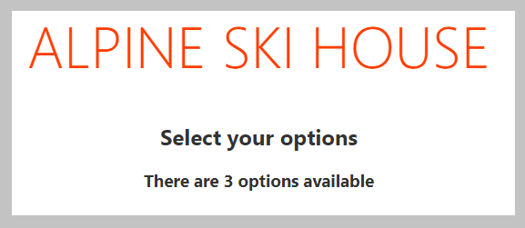

You will now update an existing Svelte application to load data. A data file has been created in the *public* folder named *data.json*. You will create the function to fetch the data, and add an `await` block to display information to the user. You will create a loading message, and show the number of available options once the data is loaded.

## Clone the starter repository

This module has an associated starter repository. This starter allows you to focus on only the concepts in this module.

You'll need [Git](https://git-scm.com/?azure-portal=true), [Node.js](https://nodejs.org/?azure-portal=true) and [Visual Studio Code](https://code.visualstudio.com/?azure-portal=true) installed.

1. Clone the starter repository and open the folder in Visual Studio Code by running the following code.

    ```bash
    git clone REPO_TBD
    cd PATH_TBD
    code .
    ```

1. Open a terminal window in Visual Studio Code by selecting *Terminal* > *New Terminal*.
1. In the newly opened terminal, run the following commands to install the required packages and start the server:

    ```bash
    npm install
    npm run dev
    ```

1. Open a browser and navigate to [http://localhost:5000](http://localhost:5000). You should see a page with the message "Alpine Ski House".

## Overview of the starter code

The starter application already contains the data you'll use in *public/data.json*. The data file has 3 objects inside an array named `options`.

*App.svelte* is the core component for the application, and the one you will be updating. It contains a simple style, including a `row` class to use the CSS Grid capabilities for displaying information. The remainder is empty, save for one `sleep` function, which will be used to simulate a long running operation.

## Add the loadData function

You will start by adding the code to load the data from *public/data.json*. *public* is the default folder for Svelte, so it will be available as the root of the application.

1. Inside Visual Studio Code, open *public/data*.
1. Note the structure of the JSON file, which contains one property named `options` for the array of various options.
1. Open *src/App.svelte*.
1. Inside the `script` block, below the line which reads `// TODO: Add loadData function`, add the following code to load the JSON data:

    ```javascript
    // TODO: Add loadData function
    async function loadData() {
        await sleep();
        const response = await fetch("./data.json");
        const json = await response.json();
        return json.options;
    }
    ```

    > [!NOTE] Because the application is loading a static HTML a sleep function has been added to simulate the long running operation.

## Add the await block to display data

Now you'll turn your attention to displaying the options. You will use the `await` block to create the loading message, and then highlight the number of options available.

1. Inside *App.svelte*, in the `main` element, add the following code below the line which reads `TODO: Add await block` to create an `await` block to display a loading message and the number of available options.

    ```html
    <!--TODO: Add await block-->
    {#await loadData()}
    Loading data...
    {:then options}
        <h2>Select your options</h2>
        <h3>There are {options.length} options available</h3>
        <!--TODO: Add code to display options-->

    {/await}
    ```

    > [!NOTE] You are adding a `TODO` block to mark where additional code will be placed during later exercises.

## Run the project to see the results

With *App.svelte* updated, you will now view the results in a browser.

1. Save all files by selecting *File* > *Save All*
1. Return to your browser, and the page should automatically refresh. If the server was stopped, you can restart it by selecting *View* > *Terminal* inside Visual Studio Code and running `npm run dev`.
1. Notice the initial message says "Loading data...", and after 4 seconds the page updates to display the number of available options.

    

## Summary

Congratulations! You have now used the `await` block to call asynchronous functions.
