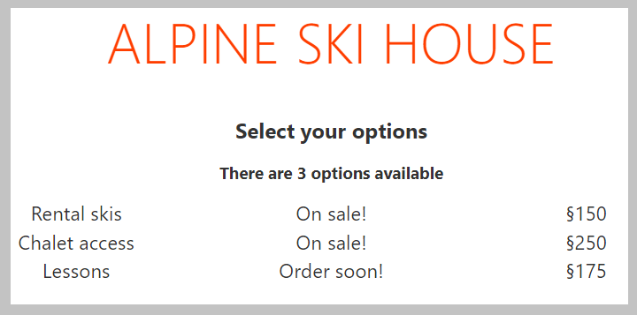

With the page displaying the list of available options, you will make one last update to display a message if an option is on sale. You will use the `if` block to display the "On sale" as appropriate.

## Update page to display sale status

You will start by updating the page with the appropriate markup to display the message.

1. Return to Visual Studio Code and open *App.svelte*.
1. Below the line which reads `TODO: Add sale display`, add the following code to display "On sale!" if an item is on sale, or "Order soon!" if not.

    ```html
    <!--TODO: Add sale display-->
    {#if option.onSale}
        On sale!
    {:else}
        Order soon!
    {/if}
    ```

## Test the page

With the page updated, you will now test the page to confirm everything works.

1. Save all files by selecting *File* > *Save all*.
1. Return to your browser, and the page should automatically refresh. If the server was stopped, you can restart it by selecting *View* > *Terminal* inside Visual Studio Code and running `npm run dev`.
1. You should now see the updated page, with "on sale" displayed for the first two items.



## Summary

You have now used `if` blocks to modify the display based on boolean values.
